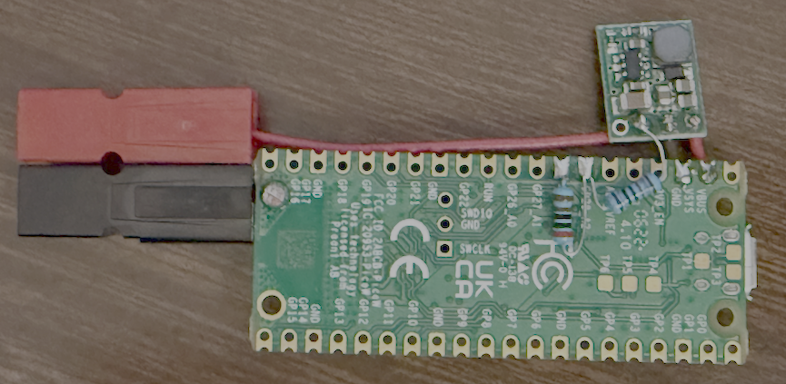

# pico-powermon
Wireless 12VDC power monitor based on Raspberry Pi Pico W

This program is intended to run continuously on a Raspberry Pi Pico W
connected to a power supply whose status is to be monitored. It sends
regular reports by UDP to a specified IP address, so that application
code on that host can use the power supply status to manage the power
state of other devices. The report contains the name of this program
as a sort of verbose protocol ID, the name of the power supply being
monitored, the Unix timestamp at which the power supply came online,
and the current power supply voltage.

Easy way to see this output on the target (relaypi):
```
$ netcat -ul -p7312
```

Typical output:
```
pi@relaypi:~ $ netcat -ul -p7312
PowerMon GH_Rigrunner 1734995540 14.1
PowerMon GH_Rigrunner 1734995540 14.1
PowerMon GH_Rigrunner 1734995540 14.1
PowerMon GH_Rigrunner 1734995540 14.1
^C
pi@relaypi:~ $ 
```

## Hardware Configuration

The Raspberry Pi Pico W is connected to the power supply via a voltage
converter, if necessary. The power supply voltage is connected to the
Pico's A2 analog input through a voltage divider to bring it into range.

Here is a typical implementation, designed to plug directly into a
PowerPole distribution strip wired according to the amateur radio standard.



